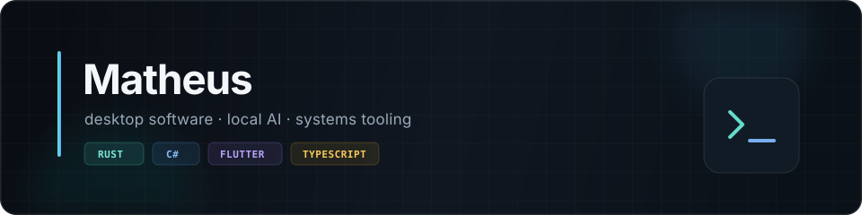

  

  <a href="#selected-work">Selected work</a> ·
  <a href="#toolkit">Toolkit</a> ·
  <a href="https://gist.github.com/MatheusANBS">Notes & snippets</a>

I build practical software for Windows, mobile, and the space between an idea and a tool people can actually use. I care about native-feeling interfaces, local-first workflows, and understanding the systems underneath the UI.

## Selected work

<table>
  <tr>
    <td width="50%" valign="top">
      <h3><a href="https://github.com/MatheusANBS/TTT">TTT</a></h3>
      
A real-time Windows memory inspector with value scanning, freezing, pointer-chain mapping, hotkeys, and reusable sessions.

      C# · Windows · systems tooling
    </td>
    <td width="50%" valign="top">
      <h3><a href="https://github.com/MatheusANBS/ByteBapo">ByteBapo</a></h3>
      
An Android client for local Ollama servers and NVIDIA models, with streaming chat, characters, Markdown, and local history.

      Flutter · Dart · local AI
    </td>
  </tr>
  <tr>
    <td width="50%" valign="top">
      <h3><a href="https://github.com/MatheusANBS/DRG-TRAINER">DRG Runtime Trainer</a></h3>
      
A compact desktop trainer built around Unreal runtime reflection, process memory tooling, configurable hotkeys, and a React interface.

      Rust · Tauri · React · TypeScript
    </td>
    <td width="50%" valign="top">
      <h3><a href="https://github.com/MatheusANBS/COMPLAT">COMPLAT</a></h3>
      
A desktop utility that matches files against name lists and produces size-limited ZIP batches without blocking the interface.

      Python · PySide6 · desktop automation
    </td>
  </tr>
</table>

## Toolkit

| Area | Tools I reach for |
| --- | --- |
| Desktop & systems | Rust, Tauri, C#, .NET, WPF, Python, PySide6 |
| Product interfaces | React, TypeScript, Vite, Flutter |
| Backend & integration | Node.js, REST APIs, SSH/SFTP, local AI runtimes |
| Delivery | GitHub Actions, Windows installers, release automation |

## Current direction

- Building desktop tools that expose complex systems through restrained, understandable interfaces.
- Exploring local-first AI clients and runtime inspection without hiding the implementation details.
- Turning one-off workflows into software that is safe to repeat.

  Most of my work starts with a real problem and ends as a small, focused product.

